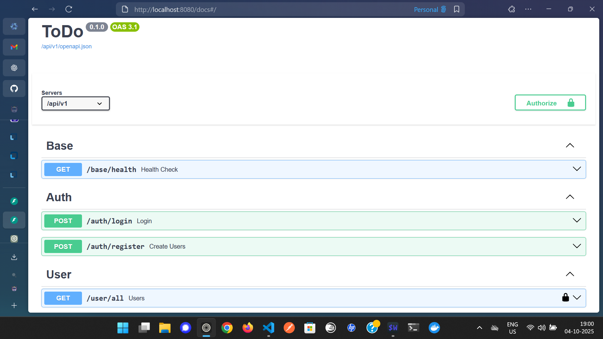
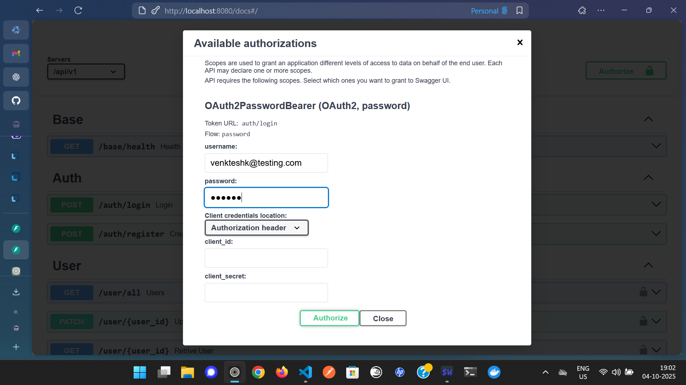

# ToDo App's Backend using Python and Fastapi

## Setup

1. Install [uv](https://docs.astral.sh/uv/getting-started/installation/) and [docker](https://www.docker.com/)
2. Setup Postgres with docker
    ```bash
    $ docker compose up
    ```
3. Install Packages
   ```sh
   $ uv run src/main.py
   ```


## OpenAPI Docs


## Token Auth
